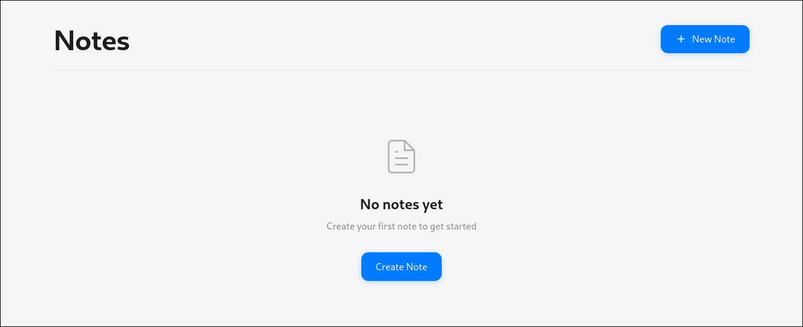
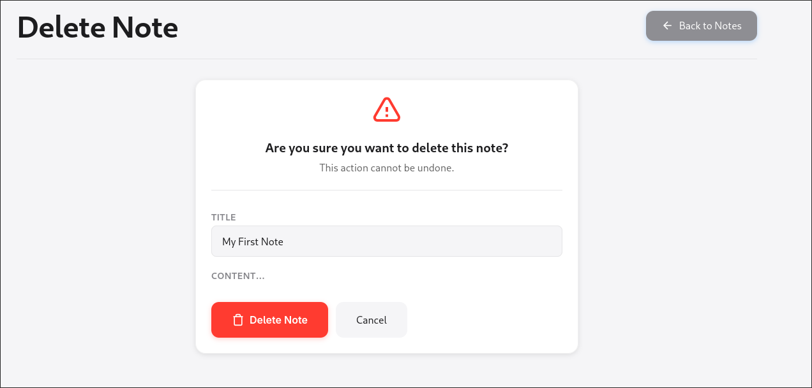
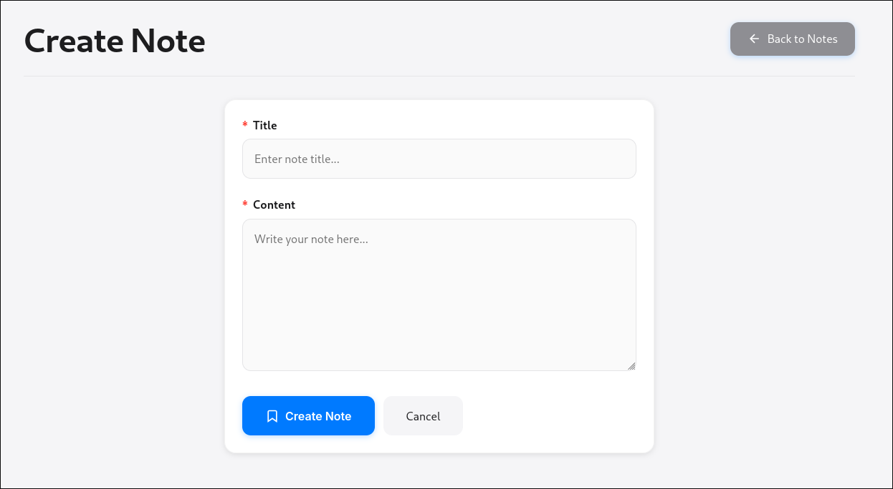

I built this project to gain experience working with databases and building my own RESTful APIs.

**MyNotesApp** is a simple ASP.NET Core Razor Pages application for creating, editing, viewing, and deleting personal notes. Built with SQLite and Entity Framework Core, this app demonstrates basic CRUD operations and Razor Page architecture in a lightweight and beginner-friendly setup featuring clean and minimal UI.

